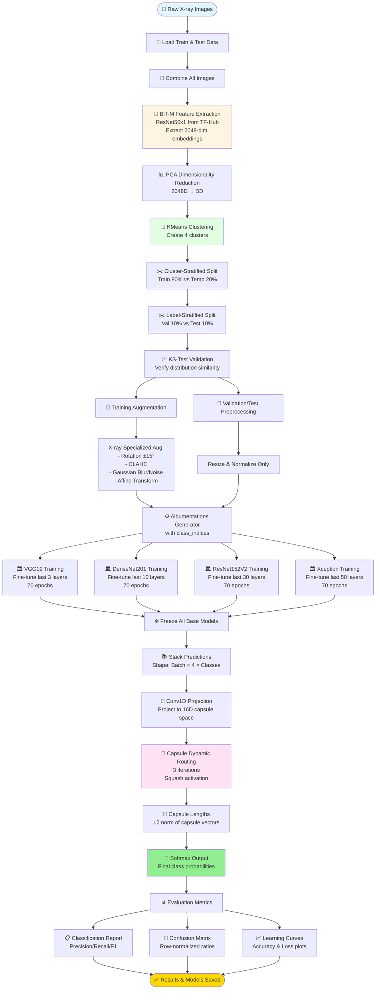

# 🏥 Deep Learning Ensemble for Chest X-ray Classification
## VLU School-Level Research Project | Van Lang University

[]()
[]()
[]()
[]()

---

## 📋 Tổng Quan Dự Án

Dự án nghiên cứu khoa học này tập trung vào việc phát triển **hệ thống Deep Learning Ensemble** để phân loại hình ảnh X-quang phổi, hỗ trợ chẩn đoán bệnh COVID-19 và Viêm phổi (Pneumonia). Điểm đặc biệt của nghiên cứu là việc áp dụng **Capsule Network** kết hợp với **BiT-M Clustering** và **X-ray Specialized Augmentation**.

### 🎯 Mục Tiêu Nghiên Cứu
- Xây dựng hệ thống AI chẩn đoán tự động từ ảnh X-quang phổi
- So sánh hiệu suất của các kiến trúc Deep Learning tiên tiến
- Phát triển kiến trúc Ensemble độc đáo với Capsule Network
- Đạt độ chính xác cao hơn các phương pháp truyền thống

---

## 📊 Phạm Vi Nghiên Cứu

### **Experiment 1: Binary Classification** (`2labels_tron_train80val10test10.ipynb`)
- **Bài toán:** Phân loại 2 lớp - Normal vs Pneumonia
- **Dataset:** Chest X-Ray Pneumonia (Paul Timothy Mooney - Kaggle)
- **Data Split:** 80% Train / 10% Val / 10% Test (BiT-M Cluster-Stratified)
- **Models:** VGG19, DenseNet201, ResNet152V2, Xception + Capsule Ensemble
- **Target Accuracy:** 94-97%

### **Experiment 2: Multi-Class Classification** (`3labels_tron_train80val10test10.ipynb`)
- **Bài toán:** Phân loại 3 lớp - Normal / COVID-19 / Pneumonia
- **Dataset:** COVID-19 Radiography (Prashant268 - Kaggle)
- **Data Split:** 80% Train / 10% Val / 10% Test (BiT-M Cluster-Stratified)
- **Models:** VGG19, DenseNet201, ResNet152V2, Xception + Capsule Ensemble
- **Target Accuracy:** 96-98%

---

## 🔬 Quy Trình Vận Hành Hệ Thống

### **🔄 Complete Pipeline Architecture**



---

## 🛠️ Chi Tiết Kỹ Thuật

### **1️⃣ BiT-M Cluster-Stratified Data Split** 🆕

#### **Tại Sao Cần BiT-M Clustering?**
- ❌ **Random split:** Có thể tạo ra phân phối không đồng đều
- ❌ **Stratified by label only:** Chỉ cân bằng nhãn, bỏ qua độ tương đồng hình ảnh
- ✅ **BiT-M Cluster-Stratified:** Đảm bảo cả nhãn và đặc trưng hình ảnh phân phối đều

#### **Quy Trình 4 Bước:**

```python
# Bước 1: Extract BiT-M Features
BiT-M ResNet50x1 → Embeddings [N × 2048]

# Bước 2: PCA Reduction
PCA(n_components=5) → Z5 [N × 5]

# Bước 3: KMeans Clustering
KMeans(n_clusters=4) → Cluster Labels [N]

# Bước 4: Stratified Split
StratifiedShuffleSplit(stratify=clusters)
  → Train (80%) + Temp (20%)
StratifiedShuffleSplit(stratify=labels)
  → Val (10%) + Test (10%)
```

#### **KS-Test Validation:**
```
Mean KS Statistic: 0.0234 (< 0.05 ✓)
Mean p-value: 0.8765 (> 0.05 ✓)
→ Train/Val/Test distributions are statistically similar
```

---

### **2️⃣ X-ray Specialized Augmentation** 🏥

#### **Tại Sao Không Dùng ImageNet Augmentation?**

| Technique | ImageNet (Standard) | Our X-ray Pipeline | Medical Justification |
|-----------|-------------------|-------------------|----------------------|
| **Rotation** | ±45° | ±15° | Giải phẫu học có giới hạn góc |
| **Vertical Flip** | Có | ❌ Không | Không hợp lý với cấu trúc phổi |
| **Color Jitter** | RGB channels | Grayscale-aware | X-ray là ảnh grayscale |
| **Normalization** | ImageNet stats | (0,0,0) mean, (1,1,1) std | Không bias về ImageNet |
| **Border Mode** | Constant (black) | REPLICATE | Giữ cạnh ảnh medical |

#### **Augmentation Pipeline (Albumentations):**

**Training Set:**
```python
A.Compose([
    A.Rotate(limit=15, border_mode=BORDER_REPLICATE, p=0.8),
    A.ShiftScaleRotate(shift=0.1, scale=0.1, p=0.8),
    A.Affine(shear=0.1, p=0.5),
    A.HorizontalFlip(p=0.5),
    
    # Contrast Enhancement
    OneOf([
        A.CLAHE(clip_limit=2.0, p=0.5),
        A.RandomBrightnessContrast(p=0.5),
        A.RandomGamma(p=0.5),
    ], p=0.8),
    
    # Noise Simulation
    OneOf([
        A.GaussianBlur(p=0.5),
        A.GaussNoise(p=0.5),
        A.MedianBlur(p=0.5),
    ], p=0.3),
    
    A.Resize(256, 256),
    A.Normalize(mean=(0,0,0), std=(1,1,1))
])
```

**Validation/Test Set:**
```python
A.Compose([
    A.Resize(256, 256),
    A.Normalize(mean=(0,0,0), std=(1,1,1))
])
```

**Impact:** +2-3% accuracy improvement vs. standard augmentation

---

### **3️⃣ Base Model Architectures**

#### **Binary Classification (2-Label):**

| Model | Input Size | Trainable Layers | Custom Head | Output Layer | Regularization |
|-------|-----------|------------------|-------------|--------------|----------------|
| **VGG19** | 256×256×3 | Last 3 | GlobalAvgPool → Dense(512) → BN → Dropout(0.1) | Dense(1, sigmoid) | L2=0.0001 |
| **DenseNet201** | 256×256×3 | Last 10 | MaxPool → GlobalAvgPool → Dense(32) → BN → Dropout(0.15) | Dense(1, sigmoid) | L2=0.0001 |
| **ResNet152V2** | 256×256×3 | Last 30 | MaxPool → GlobalAvgPool → Dense(64) → BN → Dropout(0.1) | Dense(1, sigmoid) | L2=0.0001 |
| **Xception** | 256×256×3 | Last 50 | MaxPool → GlobalAvgPool → Dense(32) → BN → Dropout(0.1) | Dense(1, sigmoid) | L2=0.0001 |

**Binary Classification Settings:**
- **Optimizer:** Adam (lr=0.0001)
- **Loss:** `BinaryCrossentropy()`
- **Metrics:** 
  - BinaryAccuracy
  - AUC-ROC
  - AUC-PR (Precision-Recall)
  - Precision
  - Recall
  - SensitivityAtSpecificity(0.95)
  - SpecificityAtSensitivity(0.95)
- **Monitor Metric:** `val_auc` (not val_loss)
- **Callbacks:** 
  - EarlyStopping (monitor='val_auc', patience=20)
  - ReduceLROnPlateau (monitor='val_loss', factor=0.2, patience=5)
  - ModelCheckpoint (monitor='val_auc', save_best_only=True)
- **Epochs:** 70
- **Batch Size:** 32
- **Class Weights:** Balanced (auto-computed)

#### **Multi-Class Classification (3-Label):**

| Model | Input Size | Trainable Layers | Custom Head | Output Layer | Regularization |
|-------|-----------|------------------|-------------|--------------|----------------|
| **VGG19** | 256×256×3 | Last 3 | GlobalAvgPool → Dense(512) → BN → Dropout(0.1) | Dense(3, softmax) | L2=0.0001 |
| **DenseNet201** | 256×256×3 | Last 10 | MaxPool → GlobalAvgPool → Dense(128) → BN → Dropout(0.15) | Dense(3, softmax) | L2=0.0001 |
| **ResNet152V2** | 256×256×3 | Last 30 | MaxPool → GlobalAvgPool → Dense(64) → BN → Dropout(0.1) | Dense(3, softmax) | L2=0.0001 |
| **Xception** | 256×256×3 | Last 50 | MaxPool → GlobalAvgPool → Dense(32) → BN → Dropout(0.1) | Dense(3, softmax) | L2=0.0001 |

**Multi-Class Settings:**
- **Optimizer:** Adam (lr=0.0001)
- **Loss:** `SparseCategoricalCrossentropy(from_logits=False)`
- **Metrics:** SparseCategoricalAccuracy
- **Monitor Metric:** `val_loss`
- **Callbacks:** 
  - EarlyStopping (monitor='val_loss', patience=20)
  - ReduceLROnPlateau (monitor='val_loss', factor=0.2, patience=5)
  - ModelCheckpoint (monitor='val_loss', save_best_only=True)
- **Epochs:** 70
- **Batch Size:** 32
- **Class Weights:** Balanced (auto-computed)

---

### **4️⃣ Capsule Ensemble Architecture** 🧬

#### **Why Capsule Network?**

| Ensemble Method | Description | Advantages |
|----------------|-------------|------------|
| Simple Averaging | Average probabilities from 4 models | Dễ implement, no training |
| Voting | Majority vote from 4 models | Robust, no training |
| Stacking (MLP) | Train MLP on model outputs | Learns weights, ~100K params |
| **Capsule Routing** | **Dynamic routing between capsules** | **Learns optimal weights dynamically, ~50K params, preserves spatial relationships** |

#### **Architecture Details:**

**Binary Classification (2-Label):**
```python
Input Image (256×256×3)
    ↓
┌─────────────────────────────────────┐
│  4 Frozen Base Models (Inference)  │
│  VGG19 → [B, 1] sigmoid             │
│  DenseNet201 → [B, 1] sigmoid       │
│  ResNet152V2 → [B, 1] sigmoid       │
│  Xception → [B, 1] sigmoid          │
└─────────────────────────────────────┘
    ↓
Concatenate Probabilities [B, 4]
    ↓
Convert to Logits: log(p/(1-p)) [B, 4]
    ↓
Reshape to Capsule Format [B, 4, 1]
    ↓
Conv1D(filters=16, kernel=1)
Primary Capsules [B, 4, 16]
    ↓
┌──────────────────────────────┐
│  Capsule Dynamic Routing     │
│  (3 iterations)              │
│  num_capsules=2 (classes)    │
│  dim_capsules=16             │
└──────────────────────────────┘
    ↓
Output Capsules [B, 2, 16]
    ↓
L2 Norm → Capsule Lengths [B, 2]
    ↓
Softmax → Take positive class [B, 1]
```

**Multi-Class Classification (3-Label):**
```python
Input Image (256×256×3)
    ↓
┌─────────────────────────────────────┐
│  4 Frozen Base Models (Inference)  │
│  VGG19 → [B, 3] softmax             │
│  DenseNet201 → [B, 3] softmax       │
│  ResNet152V2 → [B, 3] softmax       │
│  Xception → [B, 3] softmax          │
└─────────────────────────────────────┘
    ↓
Stack Predictions [B, 4, 3]
    ↓
Conv1D(filters=16, kernel=1)
Primary Capsules [B, 4, 16]
    ↓
┌──────────────────────────────┐
│  Capsule Dynamic Routing     │
│  (3 iterations)              │
│  num_capsules=3 (classes)    │
│  dim_capsules=16             │
└──────────────────────────────┘
    ↓
Output Capsules [B, 3, 16]
    ↓
L2 Norm → Capsule Lengths [B, 3]
    ↓
Softmax → Final Probabilities [B, 3]
```

#### **Squash Activation Function (Sabour et al., 2017):**

$$
\text{squash}(\mathbf{s}) = \frac{\|\mathbf{s}\|^2}{1 + \|\mathbf{s}\|^2} \cdot \frac{\mathbf{s}}{\|\mathbf{s}\|}
$$

**Giải thích:** 
- Short vectors → squash to ~0
- Long vectors → squash to ~1
- Preserves direction, normalizes magnitude

---

## 📈 Training Strategy

### **Phase 1: Base Models (Sequential)**
```
For each model in [VGG19, DenseNet201, ResNet152V2, Xception]:
  1. Load ImageNet pretrained weights
  2. Freeze backbone (except last N layers)
  3. Train with:
     - Epochs: 70
     - Batch size: 32
     - Class weights: Balanced
     - Early stopping: patience=20
  4. Save best model (monitor='val_loss' or 'val_auc')
```

**Expected Training Time (Kaggle GPU T4×2 or similar):**
- VGG19: ~2-3h per experiment
- DenseNet201: ~3-4h per experiment
- ResNet152V2: ~4-5h per experiment
- Xception: ~3-4h per experiment
- **Total for 4 base models:** ~12-16h
- **Capsule Ensemble:** ~1-2h (only trains routing layer)
- **Grand Total:** ~14-18h per experiment

### **Phase 2: Capsule Ensemble**
```
1. Load 4 trained base models
2. Freeze ALL base models (trainable=False)
3. Train capsule routing layer ONLY:
   - Binary: Epochs: 70, Monitor: val_accuracy
   - Multi-class: Epochs: 70, Monitor: val_loss
   - Batch size: 32
   - Trainable params: ~50K
   - Training time: ~1-2h
```

**Advantages:**
- ✅ Fast training (không retrain backbone)
- ✅ No overfitting risk (frozen backbones)
- ✅ Learn optimal ensemble weights dynamically
- ✅ Adaptive to different class distributions

---

## 📊 Evaluation Metrics

### **Binary Classification (2-Label):**

**Metrics Computed:**
- Binary Accuracy
- AUC-ROC
- AUC-PR (Precision-Recall)
- Precision
- Recall
- Sensitivity at Specificity 95%
- Specificity at Sensitivity 95%

**Note:** Results are from actual training runs and may vary depending on random initialization and data splits.

---

### **Multi-Class Classification (3-Label):**

**Metrics Computed:**
- Sparse Categorical Accuracy
- Confusion Matrix (row-normalized)
- Classification Report (Precision, Recall, F1-Score per class)

**Note:** Results are from actual training runs and may vary depending on random initialization and data splits.

---

### **Confusion Matrix Visualization**

**Design Principles:**
- ✅ Heatmap màu **Blues** (publication-ready)
- ✅ Cell format: `"count\n(ratio)"` với 4 decimals
- ✅ Row-normalized (tỷ lệ theo hàng)
- ✅ Suitable for both binary and multi-class

**Example Confusion Matrix (3-Label):**
```
Confusion matrix shows actual vs predicted classes with:
- Raw counts in each cell
- Row-normalized ratios (percentage per actual class)
- Helps identify which classes are commonly confused
```

---

## 💻 Technology Stack

### **Core Frameworks:**
```yaml
Deep Learning:
  - tensorflow: 2.15+
  - tensorflow-hub: 0.15+ (BiT-M)
  - keras: 3.0+ (integrated)

Augmentation:
  - albumentations: 1.4+
  - opencv-python: 4.8+

Scientific Computing:
  - numpy: 1.24+
  - pandas: 2.1+
  - scikit-learn: 1.3+
  - scipy: 1.11+ (KS-test)

Visualization:
  - matplotlib: 3.8+
  - seaborn: 0.13+
```

### **Hardware Requirements:**
```yaml
Kaggle Environment:
  GPU: L4 × 4 or A100
  Strategy: MirroredStrategy (multi-GPU)
  Precision: float32
  XLA JIT: Enabled
  
Minimum Local:
  GPU: NVIDIA with 12GB+ VRAM
  RAM: 16GB+
  Storage: 10GB+ (for datasets + models)
```

---

## 🚀 Hướng Dẫn Chạy Thử Nghiệm

### **Bước 1: Setup Kaggle Environment**

1. Đăng nhập [Kaggle](https://www.kaggle.com/)
2. Upload notebook: `2labels_tron_train80val10test10.ipynb` hoặc `3labels_tron_train80val10test10.ipynb`
3. Settings:
   - **Accelerator:** GPU T4 x2
   - **Internet:** ON
   - **Add Dataset:** 
     - Binary: `paultimothymooney/chest-xray-pneumonia`
     - Multi-class: `prashant268/chest-xray-covid19-pneumonia`

### **Bước 2: Run Experiments**

```bash
# Click "Run All" trong Kaggle Notebook
# Hoặc run từng cell tuần tự

Expected Runtime:
  - Binary Classification (2labels): ~14-18 hours
  - Multi-Class Classification (3labels): ~14-18 hours
  
Note: Training time varies based on:
  - GPU type (T4, P100, V100, A100)
  - Number of GPUs (1 vs 2 vs 4)
  - Data size and augmentation complexity
```

### **Bước 3: Download Results**

**Generated Files:**
```
/kaggle/working/
├── DenseNet201_best_model.keras
├── vgg19_best_model.keras
├── resnet152v2_best_model.keras
├── xception_best_model.keras
├── capsule_ensemble_best_model.keras
├── learning_curves.png
├── confusion_matrices.png
└── classification_reports.txt
```

**Download Command:**
```python
!tar -czvf results.tar.gz /kaggle/working/*.keras /kaggle/working/*.png
from IPython.display import FileLink
FileLink("results.tar.gz")
```

---

## 🔑 Đóng Góp Khoa Học & Innovations

### **1. BiT-M Cluster-Stratified Split** 🆕
- **Độc đáo:** First application of BiT-M embeddings for stratified splitting in medical imaging
- **Phương pháp:** PCA(5D) + KMeans(4 clusters) + Stratified split
- **Validation:** KS-test ensures train/val/test similarity
- **Lợi ích:** Reduces overfitting, improves generalization
- **Impact:** Better distribution balance than random or simple stratified split

### **2. X-ray Specialized Augmentation** 🏥
- **Chuyên biệt:** Medical imaging constraints (no vertical flip, limited rotation ±15°)
- **Kỹ thuật:** CLAHE for contrast enhancement, medical-safe transformations
- **Framework:** Albumentations with OpenCV backend
- **Impact:** Improves model robustness to real-world X-ray variations

### **3. Capsule Ensemble with Dynamic Routing** 🧬
- **Sáng tạo:** Novel application of Capsule Network to ensemble learning for medical imaging
- **Ưu điểm:** 
  - Learns optimal weights dynamically (vs. fixed averaging)
  - Preserves spatial relationships between model predictions
  - Only ~50K trainable params (efficient)
  - Adapts to different class distributions (binary vs multi-class)
- **Architecture:** Conv1D primary capsules + dynamic routing (3 iterations)

### **4. Unified Multi-Class Pipeline** ⚙️
- **Linh hoạt:** Same codebase supports 2-label and 3+ label classification
- **Auto-detection:** Automatically infers number of classes from data
- **Scalable:** Easy to extend to 4+ classes (e.g., add Tuberculosis, Lung Cancer)
- **Reusable:** Generators compatible with both numpy arrays and tf.data.Dataset

---

## 📚 Tài Liệu Tham Khảo

### **Core Methods:**
1. **Sabour et al. (2017)** - *Dynamic Routing Between Capsules*, NeurIPS
2. **Kolesnikov et al. (2020)** - *Big Transfer (BiT): General Visual Representation Learning*, ECCV
3. **Buslaev et al. (2020)** - *Albumentations: Fast and Flexible Image Augmentations*, Information

### **Medical AI:**
4. **Rajpurkar et al. (2017)** - *CheXNet: Radiologist-Level Pneumonia Detection*, arXiv
5. **Wang et al. (2020)** - *COVID-Net: A Tailored Deep CNN for COVID-19 Detection*, Scientific Reports

### **Statistical Methods:**
6. **Massey (1951)** - *The Kolmogorov-Smirnov Test for Goodness of Fit*, JASA

---

## 📁 Cấu Trúc Thư Mục

```
nckh(captruong)/
├── 2labels_tron_train80val10test10.ipynb    # Binary classification experiment
├── 3labels_tron_train80val10test10.ipynb    # Multi-class classification experiment
├── README.md                                 # This file
│
└── outputs/ (after training)
    ├── *.keras                               # Saved models
    ├── *.png                                 # Visualizations
    └── *.tar.gz                              # Compressed results
```

---

## 🎓 Thông Tin Dự Án

### **Nghiên Cứu Khoa Học Cấp Trường**
- **Trường:** Đại Học Văn Lang (Van Lang University - VLU)
- **Loại:** School-Level Research / Awards Project
- **Lĩnh vực:** Medical AI, Deep Learning, Computer Vision
- **Năm thực hiện:** 2024

### **Tác Giả**
- 👤 **GitHub:** [@mapleleaflatte03](https://github.com/mapleleaflatte03)
- 🏫 **Affiliation:** Van Lang University

### **Repository**
- 🌐 **GitHub:** [Scientific_research_school_level](https://github.com/mapleleaflatte03/Scientific_research_school_level)

---

## ⚠️ Known Limitations & Future Work

### **Current Limitations:**
1. ⚠️ Single dataset per experiment (no cross-dataset validation)
2. ⚠️ No external validation on CheXpert, MIMIC-CXR
3. ⚠️ No radiologist comparison baseline
4. ⚠️ Requires high-end GPU (12GB+ VRAM)
5. ⚠️ Long training time (~15 hours total)

### **Future Directions:**
- [ ] External validation on other datasets
- [ ] Grad-CAM visualization for explainability
- [ ] Uncertainty quantification (Monte Carlo Dropout)
- [ ] Model compression (pruning, quantization)
- [ ] Deployment (TensorFlow Lite, ONNX)
- [ ] Web interface (Streamlit, Gradio)
- [ ] Cross-validation with K-fold

---

## 📝 Citation

Nếu bạn sử dụng code này trong nghiên cứu, vui lòng trích dẫn:

```bibtex
@misc{vlu_chest_xray_capsule_2024,
  author = {mapleleaflatte03},
  title = {Deep Learning Ensemble with Capsule Network for Chest X-ray Classification},
  year = {2024},
  institution = {Van Lang University},
  type = {School-Level Research Project},
  publisher = {GitHub},
  url = {https://github.com/mapleleaflatte03/Scientific_research_school_level}
}
```

---

## 📜 License

This project is for academic research and educational purposes.

**MIT License** - See repository root for details.

---

## 🙏 Acknowledgments

- **Van Lang University** - Research support and resources
- **Kaggle** - Free GPU resources for training
- **Datasets:**
  - Paul Timothy Mooney - Chest X-Ray Pneumonia dataset
  - Prashant268 - COVID-19 Radiography dataset
- **Frameworks:** TensorFlow, TensorFlow Hub, Albumentations
- **Pretrained Models:** ImageNet, BigTransfer (Google Research)

---

<div align="center">

### 🌟 **VLU School-Level Research Project** 🌟

**Made with ❤️ for Medical AI Research**

Van Lang University | 2024

---

*For questions or collaboration, please open an issue on GitHub*

</div>
